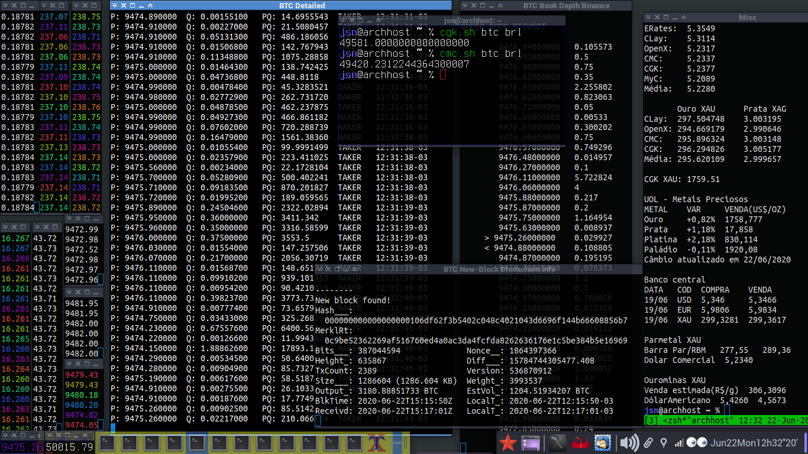

# markets

Fig. 1. Scripts on display: binance.sh, bitfinex.sh, binfo.sh,
bitstamp.sh, cgk.sh, cmc.sh and others.

---

## SUMMARY

This is a repo related to crypto, bank currency and stock markets.

Run the script with `-h` for a help page. Check below for script descriptions,
download and basic instructions to run them.

These bash scripts mostly need `curl`. Some of them will work
if you have got `wget` instead, but not all of them.
Other important packages are `jq` and `websocat` or `wscat` for some scripts.

I cannot promise to follow up api changes and update these scripts
once they start failing.  So I may just remove failing scripts
or leave them broken..

---

## SUMÁRIO

Este repo é relacionado com mercados de cripto, de moedas de
banco centrais e ações. Rode os scripts com `-h` para uma página de ajuda.

A maioria desses scripts de bash precisam do `curl`.
Alguns irão funcionar se você tiver somente o `wget`, mas não todos.
Outros pacotes importantes para alguns scripts são `jq` e
'websocat' ou `wscat`.

Não posso prometer acompanhar as alterações das APIs e atualizar esses
scripts assim que começarem a falhar.
Então, posso remover scripts com falha ou deixá-los quebrados..

---

## INDEX / ÍNDICE

SCRIPT NAME | DESCRIPTION
:-----------|:-----------
__alpha.sh__ | Stocks and currency rates from <alphaavantage.co>, most popular yahoo finance api alternative; free api key
__bakkt.sh__ | Price and contract/volume tickers from bakkt public api
__binance.sh__ |  Binance public API, crypto converter, prices, book depth, coin ticker
__binfo.sh__ | Blockchain explorer for bitcoin; uses <blockchain.info> and <blockchair.com> public apis; notification on new block found
__bitstamp.sh__ | Bitstamp exchange public api for live trade prices/info
__bitfinex.sh__ | Bitfinex exchange public api for live trade prices
__brasilbtc.sh__ | Fetches bitcoin rates from brazilian exchanges public apis. Puxa cotações de bitcoin de agências de câmbio brasileiras de apis públicas
___cgk.sh___ | <Coinggecko.com> public api, convert one crypto, bank/fiat or metal currency into any another, market ticker, cryptocurrency ticker. This is my favorite everyday-use script for all-currency rates!
__clay.sh__ | <Currencylayer.com> central bank currency, precious metal and cryptocurrency converter, free api key
__cmc.sh__ |  <Coinmarketcap.com> convert any amount of one crypto, bank/fiat currency or metal into any another, NON-public api access
__erates.sh__ | <Exchangeratesapi.io> public api, currency converter (same API as Alexander Epstein's Bash-Snippets/currency)
__foxbit.sh__ | FoxBit exchange public API rates. Acesso ao api público da Foxbit para cotações
__hgbrasil.sh__ | Bovespa and tax rates. Cotações de ações da Bovespa e índices e taxas (CDI e SELIC) do api da hg brasil
__myc.sh__ | <Mycurrency.net> public api, central bank currency rate converter
__metais.sh__ | script to retrieve various rates, mostly using other scripts from this repo; there are some unique shell functions, though
___mkt_func.sh___ | shell functions (bash and z-shell) to get some market data from public apis. Google Finance and Yahoo! Finance hacks.. these functions need improvement; source from this file to make these funtions available in your shell
__novad.sh__ | puxa dados das apis públicas da NovaDax brasileira. fetch public api data from NovaDax brazilian enchange
__openx.sh__ | <Openexchangerates.org> central bank currencies and precious metals converter, free api key
__ourominas.sh__ | Ourominas (precious metals exchange) rates public api. Pega taxas da api pública da Ouro Minas
__parmetal.sh__ | Parmetal (precious metals exchange) rates public api. Pega taxas da api pública da Parmetal
__pricesroll.sh__ | script to open and arrange terminal windows with these market scripts on X
__stocks.sh__ | <Financialmodelingprep.com> latest and historical stock and major index rates
__tradingview.sh__ | just open some tradingview windows at the right screen position with xdotool
__uol.sh__ | Fetches rates from uol service provider public api. Puxa dados de páginas da api pública do uol economia
__wexplorer.sh__ | get some data from <https://www.walletexplorer.com>; this script usage is not very comprehensible and API server may be slow
__whalealert.sh__ | latest whale transactions from <whale-alert.io>; this is such a bad api, very limited, not even worth having written a script for this, free api key
__yahooscrape.sh__ | scrape some yahoo! finance tickers

For a large list of Yahoo! Finance symbols, [check my lists](../repo/extra/yahooFinanceSymbols)

---

## API KEYS / CHAVES DE API

Please create free API keys and add them to shell environment or set
them in the script head source code. Demo api keys were added to the scripts,
however they may stop working at any time or get rate limited quickly.

Por favor, crie chaves de API grátis e as adicione no ambiente da shell
ou as configure na cabeça do código-fonte dos scripts. Chaves para fins
de demonstração foram adicionadas aos scripts, porém elas podem parar 
de funcionar a qualquer momento ou serem limitadas rapidamente.
  
---

## SEE ALSO / TAMBÉM VEJA</b>

_bcalc.sh_ -- a wrapper for bash calculator and zshell maths that keeps a record of results

<https://github.com/mountaineerbr/scripts/blob/master/bcalc.sh>

Alexander Epstein's _currency_bash-snipet.sh_ uses the same API as _erates.sh_

<https://github.com/alexanderepstein>

MiguelMota's _Cointop_ for crypto currency tickers

<https://github.com/miguelmota/cointop>

8go's _CoinBash.sh_ for CoinMarketCap simple tickers (outdated)

<https://github.com/8go/coinbash> 

Brandleesee's _Mop: track stocks the hacker way_

<https://github.com/mop-tracker/mop>

Packages `units` and `qalc` (qalculate) also have got
bank currency rate convertion although they are not as powerful as my scripts.

---

## IMPORTANT / IMPORTANTE

None of these scripts are supposed to be used under truly professional constraints. Do your own research!

Nenhum desses scripts deve ser usado em meio profissional sem análise prévia. Faça sua própria pesquisa!

---

> If useful, please consider sending me a nickle! =)
>  
> Se foi útil, considere me lançar um trocado!
>
>    bc1qlxm5dfjl58whg6tvtszg5pfna9mn2cr2nulnjr

---

## BASIC INSTRUCTIONS

On Ubuntu 20.04, you can install `curl`, `jq` and `lolcat` packages easily from the official repos.
The `websocat` and `wscat` packages may be a little more complicated..

To download a script, view it on Github.
Then, right-click on the _Raw_ button and choose _Save Link As ..._ option.
Once downloaded (_eg_ `~/Downloads/binance.sh`),
you will need to mark the script as executable.
In GNOME, _right-click on the file > Properties > Permissions_
and check the _Allow executing file as programme_ box, or

```bash
chmod +x ~/Downloads/binance.sh
```

Then cd to the folder where the script is located.

```bash
cd ~/Downloads
```

To execute it, be sure to add './' before the script name:

```bash
./binance.sh
```
 
or

```bash
bash binance.sh
```

Alternatively, you can clone this entire repo.

```bash
cd Downloads

git clone https://github.com/mountaineerbr/markets.git

chmod +x ~/Downloads/markets/*.sh
```

You can use bash aliases to individual scripts or place them under your $PATH .

Some scripts need free api keys. You can test these scripts with
the builtin demo key, however that may stop working at any time.

---

## INSTRUÇÕES BÁSICAS

No Ubuntu 20.04, pode-se instalar os pacotes `curl`, `jq` e `lolcat`
facilmente dos repos oficiais.
Já o pacote `websocat` e `wscat` podem ser um pouco mais complicado..

Para fazer o download de um script, abra-o/visualize-o no Github e
depois clique com o botão direito do mouse em cima do botão _Raw_ e
escolha a opção _Salvar Link Como..._.
Depois de feito o download (_por exemplo_, em `~/Downloads/binance.sh`),
será necessário marcar o script como executável.
No GNOME, clicar com o botão direito em
_cima do arquivo > Propriedades > Permissões_ e selecione a caixa
_Permitir execução do arquivo como programa_, ou

```bash
chmod +x ~/Downloads/binance.sh
```

Então, caminhe até a pasta onde script se encontra.

```bash
cd ~/Downloads
```

Para executá-lo, não se esqueça de adicionar './' antes do nome do script:

```bash
./binance.sh
```

ou


```bash
bash binance.sh</i>
```

Alternativeamente, você pode clonar este repo inteiro.

```bash
cd Downloads

git clone https://github.com/mountaineerbr/markets.git

chmod +x ~/Downloads/markets/*.sh
```

Você pode fazer bash aliases individuais para os scripts
ou colocar os scripts sob seu $PATH .

Alguns scripts precisam de chaves de API gratuitas.
Você pode testá-los com as chaves de APIs de demonstração
adicionadas nos scripts, porém elas podem parar de funcionar
a qualquer tempo.

---

> Please consider sending me a nickle!  = )
>
>    bc1qlxm5dfjl58whg6tvtszg5pfna9mn2cr2nulnjr

